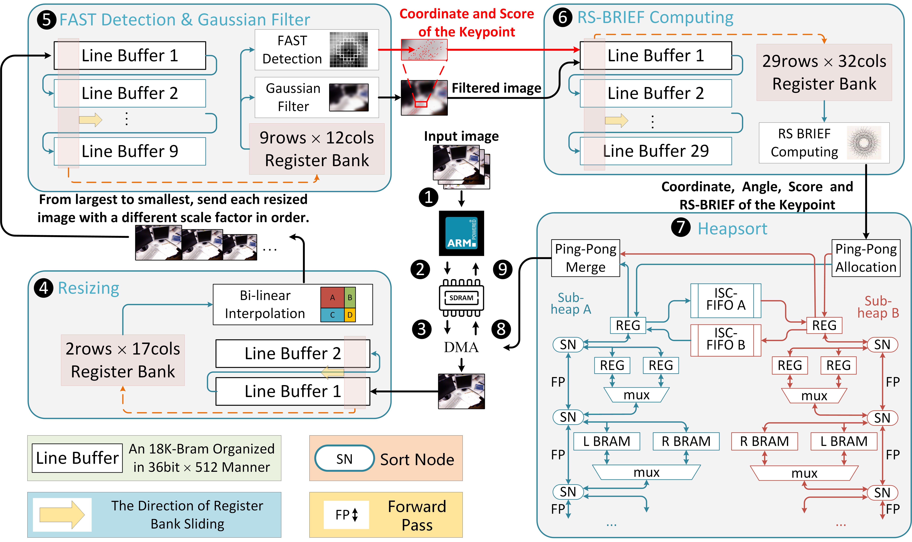

# acSLAM

## Introduction
Simultaneous Localization and Mapping (SLAM) is the algorithm for constructing a map and keeping tracking robot localization in unknown surroundings, which is critical for acting as the necessary underlying component to support high-level applications, like navigation and multi-agent collaboration.
When it comes to deployment on autonomous mobile robots, constrained by the stringent power budget and physical size, the compute power on embedded devices is insufficient to serve the SLAM algorithms in real-time.

This project includes a complete acceleration scheme based on the ORB-SLAM2 algorithm, called acSLAM, including both front-end and back-end.

## Architecture Overview
### System
We implement ORB extractor and heapsort as specialized hardware modules, and combine with the CPU to realize a heterogeneous end-to-end system for ORB-SLAM2. The overall workflow of the system is shown below:

## Results on ZCU104 Board
### 1.Resource Utilizaton
|     | Utilization  | Available | Utilization % |
|  ----  | ----  | ----  | ----  |
| CLB LUTs  | 174737 | 230400 | 75.84 |
| FF  | 93306 | 460800 | 20.25 |
| BRAM  | 285 | 312 | 91.35 |
| URAM  | 6 | 96 | 6.25 |
| DSP  | 180 | 1728 | 10.42 |

 The latency of feature extraction in 4-level image pyramid for TUM and 8-level image pyramid for KITTI is shown below:
 |     | TUM(640×480)  | KITTI(1241×376) |
|  ----  | ----  | ----  |
| latency  | 2.0ms | 5.1ms |

 
Compared with running ORB-SLAM2 on  the ARM processor, acSLAM achieves 2.1× and 2.7× faster in the TUM and KITTI datasets, while maintaining 10% error of SOTA eSLAM. In addition, the FPGA accelerated front-end achieves 4.55× and 40× faster than eSLAM and ARM. 
